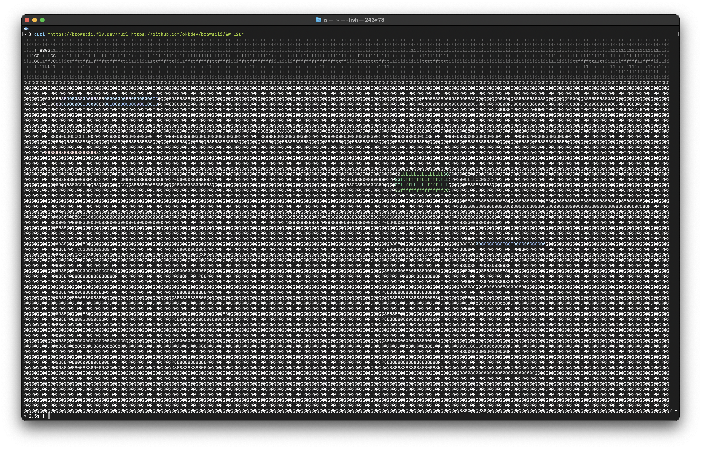

# browscii

useless little service to view websites as ascii screenshot in the terminal



## Usage

`curl` the service and add the site you want to see as `url` query:

```sh
curl 'localhost:3000/?url=https:google.com'
```

additional query parameters are:

- `w` to change the width of the ascii screenshot. default: `50`
- `full` lets you screenshot the whole page. default: `false`
